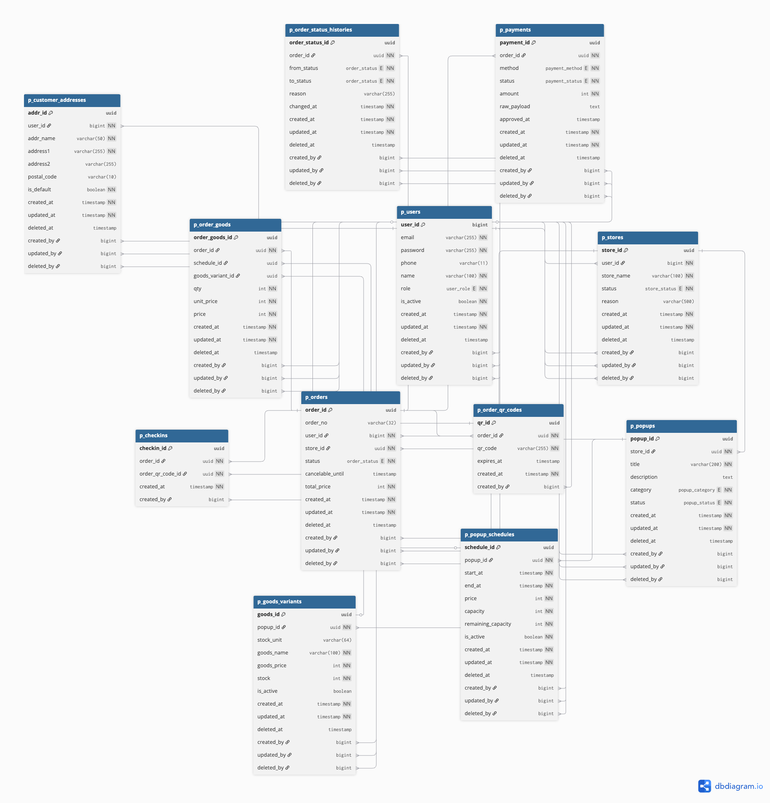

<p align="center">
  
</p>

# 🍿 PopCorn Backend


<p align="center">
  팝업 예약·주문·결제·QR·체크인까지 연결하는 오프라인 이벤트 이커머스 플랫폼입니다.
</p>

<p align="center">
  <strong>Java 17</strong> · <strong>Spring Boot 3.5.9</strong> · <strong>PostgreSQL</strong> · <strong>JPA</strong>
</p>

## Getting Started
```bash
cd backend
./gradlew bootRun
```

## Overview
- 프로젝트 기간: 2025-12-22 ~ 2026-01-09
- 목표: 정보 탐색 → 방문 예약 → 체크인 → 굿즈 주문 흐름을 하나로 연결

## Quick Links
- Swagger UI: http://localhost:8080/swagger-ui.html
- OpenAPI JSON: http://localhost:8080/v3/api-docs

## Team
| 김리연(팀장) | 김세헌 | 서원지 | 오채영 | 이준범 | 홍준표 |
|:---:|:---:|:---:|:---:|:---:|:---:|
| Manager 구현 | Owner(스토어/팝업/스케줄) | Order & Reservation | 회원가입/로그인, 인증·인가 | 굿즈(Merch) | Product & QR, 결제(Pay) |

## Key Features
- 회원가입/로그인(JWT), 인증·인가
- Owner: 스토어 CRUD, 팝업 CRUD, 스케줄 관리
- 주문/예약 생성 및 상태 변경
- 결제 생성/승인/실패/취소, 결제 조회
- QR 발급/조회/검증, 체크인 조회

## Roles
- CUSTOMER: 예약/주문 생성, 내 예약/주문 조회, 취소 요청
- OWNER: 내 행사 예약/내 가게 주문 조회, 운영 상태 변경
- MANAGER: 할당된 store/popup 범위 내 조회/운영 변경/체크인
- ADMIN (MASTER): 전체 조회, 예외/강제 상태 변경, 감사 로그 조회


## Tech Stack
- Language: Java 17
- Framework: Spring Boot 3.5.9 (WebMVC)
- ORM: Spring Data JPA
- Database: PostgreSQL 18.1
- Migration: Flyway
- Cache: Caffeine
- API Docs: SpringDoc OpenAPI (Swagger)
- Build: Gradle

## Project Structure
```plaintext
backend/
├── src/main/java/com/popcorn/demo
│   ├── domain
│   │   ├── auth
│   │   ├── users
│   │   ├── store
│   │   ├── popup
│   │   ├── goods
│   │   ├── order
│   │   ├── payment
│   │   ├── qr
│   │   └── checkin
│   ├── global
│   └── common
└── src/test/java/...
```

## ERD
<p align="center">
  
</p>

## Environment
```plaintext
backend/.env
backend/.env.example
```
필수 변수:
- DB_HOST
- DB_PORT
- DB_NAME
- DB_USERNAME
- DB_PASSWORD
