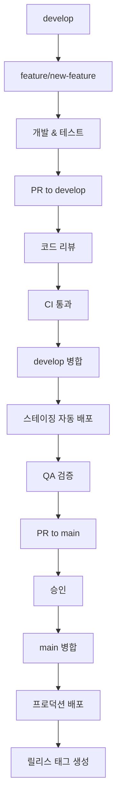

# Git Flow 브랜치 전략 가이드

## 📋 개요

Goorm Popcorn 프로젝트는 **Git Flow** 브랜치 전략을 사용하여 안정적이고 체계적인 개발 프로세스를 구현합니다.

## 🌳 브랜치 구조

### 1. main (프로덕션)

```yaml
목적: 항상 배포 가능한 상태 유지
특징:
  - Protected Branch (보호된 브랜치)
  - PR + 승인 필수
  - 자동 태그 생성
  - 수동 승인 후 프로덕션 배포
  - 모든 커밋이 릴리스 가능한 상태

보호 규칙:
  - Direct push 금지
  - PR 필수
  - 최소 1명 승인 필요 (Payment Service는 2명)
  - Status check 통과 필수
  - Up-to-date branch 필수
```

### 2. develop (스테이징)

```yaml
목적: 개발 통합 브랜치
특징:
  - 모든 feature 브랜치의 통합점
  - 자동 스테이징 배포
  - QA 테스트 환경
  - CI/CD 자동 실행

워크플로우:
  - feature/* → develop 병합 시 자동 스테이징 배포
  - 통합 테스트 및 QA 검증
  - 안정화 후 main으로 PR 생성
```

### 3. feature/* (기능 개발)

```yaml
명명 규칙:
  - feature/user-authentication
  - feature/payment-integration
  - feature/order-management
  - feature/qr-code-generation

특징:
  - develop에서 분기
  - develop으로 병합
  - 개별 기능 개발용
  - CI 자동 실행 (테스트, 빌드, 보안 스캔)

생명주기:
  1. develop에서 feature 브랜치 생성
  2. 기능 개발 및 테스트
  3. develop으로 PR 생성
  4. 코드 리뷰 및 승인
  5. develop 병합 후 브랜치 삭제
```

### 4. hotfix/* (긴급 수정)

```yaml
명명 규칙:
  - hotfix/critical-payment-bug
  - hotfix/security-vulnerability
  - hotfix/production-crash

특징:
  - main에서 분기
  - main + develop 동시 병합
  - 즉시 프로덕션 배포
  - 긴급 상황 전용

생명주기:
  1. main에서 hotfix 브랜치 생성
  2. 긴급 수정 작업
  3. 자동 CI/CD 실행
  4. 자동 프로덕션 배포
  5. main과 develop에 동시 병합
  6. 긴급 릴리스 태그 생성
```

## 🔄 워크플로우 프로세스

### 일반 개발 워크플로우



### 상세 단계별 프로세스

#### 1단계: Feature 브랜치 생성

```bash
# develop에서 최신 코드 가져오기
git checkout develop
git pull origin develop

# feature 브랜치 생성
git checkout -b feature/user-authentication

# 개발 작업 수행
echo "// 새로운 기능" >> users/src/main/java/AuthService.java
git add users/
git commit -m "feat: 사용자 인증 기능 추가"
git push origin feature/user-authentication
```

#### 2단계: develop으로 PR 생성

```yaml
PR 생성 시 자동 실행:
  ✅ Feature Branch CI 워크플로우
  ✅ 코드 품질 검사 (Checkstyle, SpotBugs)
  ✅ 단위 테스트 (80% 커버리지 필수)
  ✅ 통합 테스트 (PostgreSQL, Redis, Kafka)
  ✅ 보안 스캔 (Snyk, SAST)
  ✅ Docker 이미지 빌드 검증
```

#### 3단계: 코드 리뷰 및 승인

```yaml
리뷰 체크리스트:
  - 코드 품질 및 컨벤션 준수
  - 테스트 커버리지 80% 이상
  - 보안 취약점 없음
  - 성능 영향도 검토
  - 문서 업데이트 여부
```

#### 4단계: develop 병합 → 스테이징 배포

```bash
# PR 승인 후 자동 실행
✅ develop 병합
✅ 해당 서비스 CI/CD 워크플로우 실행
✅ 스테이징 환경 자동 배포
✅ Discord 알림 발송
```

#### 5단계: QA 검증

```yaml
QA 환경:
  - URL: https://staging.goormpopcorn.com
  - 데이터베이스: 스테이징 전용 DB
  - 외부 API: 테스트 환경 연동
  - 모니터링: CloudWatch 대시보드
```

#### 6단계: main으로 PR 생성

```bash
# QA 검증 완료 후
git checkout main
git pull origin main
git checkout develop
git pull origin develop

# main으로 PR 생성 (GitHub UI에서)
# 또는 GitHub CLI 사용
gh pr create --base main --head develop --title "Release: v1.2.0" --body "QA 검증 완료된 기능들"
```

#### 7단계: 프로덕션 배포

```yaml
승인 후 자동 실행:
  ✅ main 병합
  ✅ 프로덕션 배포 (수동 승인 필요)
  ✅ 릴리스 태그 자동 생성
  ✅ Discord 알림 발송
```

### 긴급 수정 워크플로우 (Hotfix)

```bash
# 1. main에서 hotfix 브랜치 생성
git checkout main
git pull origin main
git checkout -b hotfix/critical-payment-bug

# 2. 긴급 수정 작업
echo "// 버그 수정" >> payment/src/main/java/PaymentService.java
git add payment/
git commit -m "hotfix: 결제 시스템 크리티컬 버그 수정"
git push origin hotfix/critical-payment-bug

# 3. 자동 실행 (feature-branch-ci.yml)
✅ CI 파이프라인 실행
✅ 자동 프로덕션 배포
✅ 긴급 릴리스 태그 생성
✅ Discord 긴급 알림

# 4. main과 develop에 병합 (수동)
git checkout main
git merge hotfix/critical-payment-bug
git push origin main

git checkout develop
git merge hotfix/critical-payment-bug
git push origin develop

# 5. hotfix 브랜치 삭제
git branch -d hotfix/critical-payment-bug
git push origin --delete hotfix/critical-payment-bug
```

## 🛡️ 브랜치 보호 규칙

### main 브랜치 보호 설정

```yaml
GitHub Repository Settings → Branches → Add rule:

Branch name pattern: main

보호 규칙:
  ✅ Require a pull request before merging
    - Require approvals: 1 (Payment Service: 2)
    - Dismiss stale PR approvals when new commits are pushed
    - Require review from code owners
  
  ✅ Require status checks to pass before merging
    - Require branches to be up to date before merging
    - Status checks:
      - test (Backend Service Tests)
      - security-scan (Security Scan)
      - build-and-deploy (Build and Deploy)
  
  ✅ Require conversation resolution before merging
  ✅ Require signed commits
  ✅ Include administrators
  ✅ Restrict pushes that create files
```

### develop 브랜치 보호 설정

```yaml
Branch name pattern: develop

보호 규칙:
  ✅ Require a pull request before merging
    - Require approvals: 1
  
  ✅ Require status checks to pass before merging
    - Status checks:
      - feature-ci (Feature Branch CI)
  
  ✅ Require conversation resolution before merging
```

## 📊 CI/CD 파이프라인 매핑

### Feature Branch → develop PR

```yaml
워크플로우: feature-branch-ci.yml
트리거: PR to develop
단계:
  1. 코드 체크아웃
  2. 환경 설정 (JDK 17)
  3. 의존성 캐시
  4. 코드 품질 검사 (Checkstyle, SpotBugs)
  5. 단위 테스트 (JUnit)
  6. 커버리지 검증 (80% 이상)
  7. 통합 테스트 (PostgreSQL, Redis, Kafka)
  8. 보안 스캔 (Snyk, SAST)
  9. Docker 이미지 빌드 검증
  10. Discord 알림
```

### develop → Staging 배포

```yaml
워크플로우: [service]-service.yml
트리거: Push to develop
단계:
  1-9. (Feature CI와 동일)
  10. Docker 이미지 빌드
  11. ECR 푸시
  12. 이미지 보안 스캔 (Trivy)
  13. 스테이징 배포
  14. Discord 알림
```

### main → Production 배포

```yaml
워크플로우: [service]-service.yml
트리거: Push to main
단계:
  1-13. (Staging과 동일)
  14. 수동 승인 대기
  15. 프로덕션 배포
  16. 릴리스 태그 생성
  17. Discord 알림
```

### Hotfix → Emergency 배포

```yaml
워크플로우: feature-branch-ci.yml (hotfix-deploy job)
트리거: Push to hotfix/*
단계:
  1-9. (Feature CI와 동일)
  10. Docker 이미지 빌드 & 푸시
  11. 긴급 프로덕션 배포
  12. 긴급 릴리스 태그 생성
  13. Discord 긴급 알림
```

## 🏷️ 태그 및 릴리스 전략

### 자동 태그 생성 규칙

```yaml
일반 릴리스:
  - 패턴: [service-name]-v[run-number]
  - 예시: backend-service-v42, payment-service-v15

긴급 릴리스:
  - 패턴: [service-name]-hotfix-v[run-number]
  - 예시: payment-service-hotfix-v3

태그 정보:
  - 배포된 커밋 SHA
  - 작성자 정보
  - 배포 시간
  - 변경사항 요약
  - ECR 이미지 정보
```

### 릴리스 노트 자동 생성

```yaml
포함 내용:
  - 서비스명 및 버전
  - 배포 환경 (Production/Emergency)
  - 커밋 메시지
  - 작성자 및 시간
  - Docker 이미지 태그
  - ECR 저장소 정보
```

## 📈 모니터링 및 메트릭

### 브랜치별 배포 통계

```bash
# GitHub CLI를 사용한 통계 확인
gh api repos/:owner/:repo/deployments --jq '.[] | {environment, ref, created_at}'

# 브랜치별 커밋 통계
git log --oneline --graph --all --since="1 month ago"
```

### CI/CD 성공률 모니터링

```yaml
모니터링 지표:
  - Feature CI 성공률
  - 평균 빌드 시간
  - 테스트 커버리지 추이
  - 보안 스캔 결과
  - 배포 성공률
  - 롤백 빈도
```

## 🚨 비상 상황 대응

### 프로덕션 장애 시

```bash
# 1. 즉시 롤백
cd .aws
./deploy.sh [service-name] prod [previous-working-tag]

# 2. Hotfix 브랜치 생성
git checkout main
git checkout -b hotfix/production-fix

# 3. 긴급 수정 후 자동 배포
git commit -m "hotfix: 프로덕션 장애 수정"
git push origin hotfix/production-fix
```

### 배포 실패 시

```yaml
자동 대응:
  - Discord 즉시 알림
  - 이전 버전으로 자동 롤백 (설정 시)
  - CloudWatch 알람 발생

수동 대응:
  - 로그 분석 (GitHub Actions, CloudWatch)
  - 원인 파악 및 수정
  - 재배포 또는 롤백 결정
```

## 📚 참고 자료

### Git Flow 관련 문서
- [Git Flow 공식 문서](https://nvie.com/posts/a-successful-git-branching-model/)
- [GitHub Flow vs Git Flow](https://lucamezzalira.com/2014/03/10/git-flow-vs-github-flow/)

### GitHub 설정 가이드
- [Branch Protection Rules](https://docs.github.com/en/repositories/configuring-branches-and-merges-in-your-repository/defining-the-mergeability-of-pull-requests/about-protected-branches)
- [Required Status Checks](https://docs.github.com/en/repositories/configuring-branches-and-merges-in-your-repository/defining-the-mergeability-of-pull-requests/about-status-checks)

---

**문서 버전**: 1.0  
**최종 업데이트**: 2024-01-26  
**작성자**: DevOps Team